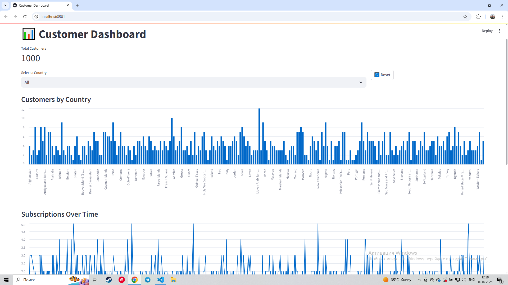

# 🧮 Customer Dashboard: CSV → SQLite → Streamlit

A lightweight end-to-end data dashboard that:
- Loads customer data from a CSV file
- Stores it in a local SQLite database
- Visualizes key insights using Streamlit

## 💾 Technologies
- Python
- Pandas
- SQLite
- Streamlit

## 🚀 How to Run

1. Clone the repo:
```bash
git clone https://github.com/your-username/csv-sql-dashboard.git
cd csv-sql-dashboard 
```

2. Create a virtual environment (optional but recommended):
```
python -m venv venv
source venv/bin/activate  # for Linux/macOS
venv\Scripts\activate     # for Windows
```
3. Install dependencies
```
pip install -r requirements.txt
```
4. Run the project
```
python main.py
```
This will:

 - Load the customer data from data/customers.csv into a SQLite database

 - Launch a Streamlit dashboard in your browser

## Project Structure

```
csv-sql-dashboard/
├── data/
│   └── customers.csv
├── database/
│   └── customers.db
├── dashboard/
│   └── app.py
├── scripts/
│   └── load_data.py
├── main.py
├── requirements.txt
└── README.md
```
## Preview


## 👤 Author
- Name: Azizbek Sattorov

- Email: imfyashya@gmail.com

- Telegram: [@fie_n](https://t.me/fie_n)

- LinkedIn: [https://www.linkedin.com/in/azizbek-sattorov-6a5678343/](https://www.linkedin.com/in/azizbek-sattorov-6a5678343/)
